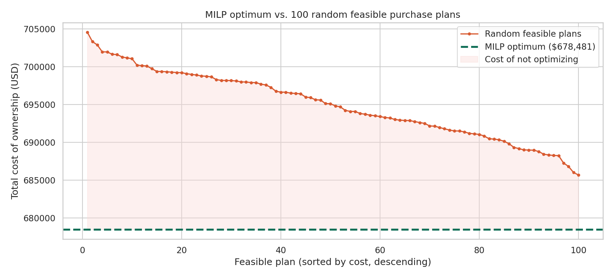
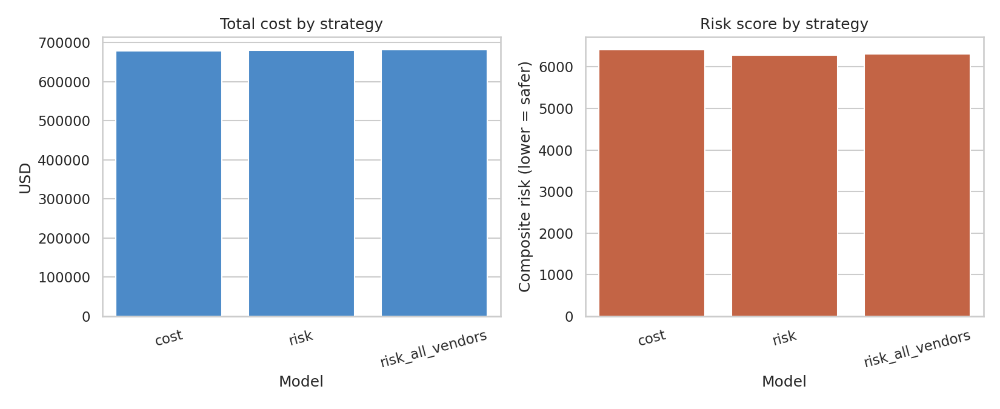
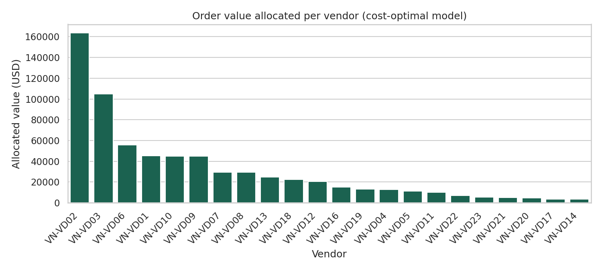
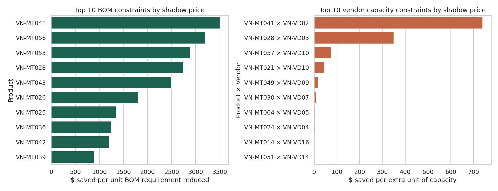

# Supplier Selection & Dynamic Volume Allocation

A Mixed-Integer Linear Programming (MILP) system that decides how much to
purchase from which vendor — under real-world MOQ, capacity, and BOM
tolerance constraints — while minimizing cost or a blended price/lead-time
risk score. Built with [OR-Tools](https://developers.google.com/optimization)
(SCIP backend).



*Every point above the dashed line is a valid, constraint-satisfying
purchase plan — none of them beat the optimizer. That gap is the cost of
sourcing decisions made without optimization.*

## Executive summary

Four analyses, four different business questions, run on the real
66-product / 23-vendor dataset in this repo:

| Analysis | Business question it answers | Headline number |
|---|---|---|
| [Risk-balanced sourcing](#results) | How much does de-risking lead time cost? | +0.3% cost cuts risk score by 1.8% |
| [Relationship-preserving sourcing](#results) | What does keeping every vendor active cost? | +$2,105 to keep all 23 vendors alive |
| [Shadow price analysis](#shadow-price-analysis-real-dataset) | Which constraint is most valuable to renegotiate? | $740/unit — vendor `VN-VD02`'s capacity on `VN-MT041` |
| [Excluded-vendor opportunity cost](#shadow-price-analysis-real-dataset) | Which backup vendor is closest to being used? | Vendor `VN-VD15` is only $70 from entering the optimal plan |

Each row is a different lever a procurement team can actually pull —
policy trade-off, negotiation priority, or supply-chain contingency —
not just a different way of looking at the same number. Details and
methodology for each below.

## Why this exists

Multi-vendor sourcing is a combinatorial problem: with dozens of products
and a handful of vendors per product, the number of valid ways to split an
order explodes, and each vendor has its own price, MOQ, and capacity
constraints layered on top. Buyers typically solve this by hand — sort by
price, buy from the cheapest vendor first, adjust when MOQ or capacity gets
in the way. That heuristic is *fast*, but leaves money on the table and
carries hidden lead-time risk that a spreadsheet won't surface.

This project reformulates the problem as a MILP and solves it exactly,
then benchmarks the result against both a manual baseline and 100
random-but-feasible alternatives to make the value of optimization
concrete and visual.

## What it does

The solver runs three sourcing strategies over the same dataset:

| Strategy | Optimizes for | Vendor policy |
|---|---|---|
| **Cost-optimal** | Lowest total cash cost | Only vendors that help minimize cost are used |
| **Risk-balanced** | Composite score: 40% price + 60% lead time | Only vendors that help minimize risk are used |
| **Relationship-preserving** | Risk, with every vendor guaranteed at least one order | Every vendor in the pool stays active |

Full mathematical formulation: [`docs/methodology.md`](docs/methodology.md).

## Results

Ran against a real 66-product / 23-vendor procurement dataset (`data/procurement_data.xlsx`):

| Model | Total cost | Risk score | Vendors used |
|---|---|---|---|
| Cost-optimal | $678,481 | 6,408 | 22 / 23 |
| Risk-balanced | $680,446 | 6,291 | 22 / 23 |
| Relationship-preserving | $680,586 | 6,314 | 23 / 23 |

Switching from cost-only to risk-balanced sourcing costs **+0.3%** in cash
but cuts the composite lead-time/price risk score by **1.8%** — a small
but real trade-off a category manager can make deliberately instead of
by accident. Against a manual (greedy, cheapest-first) baseline, the
MILP solution saves $110.83 — the two are close on this particular
dataset because most products here only have 1–2 viable vendors, leaving
little room for a smarter allocation to beat the obvious choice. The
Monte Carlo chart above still makes the case clearly: every one of 100
random feasible plans costs $7,000–$27,000 more than the true optimum.




Regenerate these numbers and charts anytime with `python -m src.run_analysis`.

## Dataset

`data/procurement_data.xlsx` — 66 products, 23 vendors, 128
vendor-product quotations. This is a real sourcing dataset, included
directly in the repo (no synthetic placeholder — see "Using your own
data" below if you want to swap in something else).

## Shadow price analysis (real dataset)

Ran on `data/procurement_data.xlsx` — a real 23-vendor / 66-product
procurement dataset. Shadow prices were computed via **fix-and-relax**
(see [`docs/methodology.md`](docs/methodology.md#extending-this-shadow-price-analysis-and-the-pareto-frontier))
and independently validated by re-solving the full MILP after perturbing
each binding constraint by one unit — the reported shadow price matched
the actual cost change exactly in every case checked.



The highest-value finding: product `VN-MT041` is capacity-constrained at
vendor `VN-VD02` — every extra unit of capacity that vendor could supply
is worth **$740** in cost avoidance, by far the single most valuable
constraint to renegotiate in this dataset. Full per-product and
per-vendor tables: `assets/shadow_price_*.csv`. Reproduce with:

```bash
python -m src.run_shadow_price_analysis
```

**What about vendors that weren't selected at all?** Fix-and-relax duals
only cover constraints tied to vendors already in the optimal solution —
an excluded vendor's variable is dropped from the relaxed LP entirely, so
there's no dual to read. Answering "how close was this vendor to being
worth using?" instead requires re-optimization: `compute_unused_vendor_opportunity()`
forces each excluded vendor's `z[v] = 1` and re-solves the full MILP. On
this dataset, exactly one vendor (`VN-VD15`) was excluded — forcing it in
costs only **$70** more than the optimum, meaning a small price
concession or better terms could flip it into the optimal plan. See
`docs/methodology.md` for why this needs a different technique than the
dual-value approach above.


```
procurement-optimization/
├── src/
│   ├── solver.py                    # Core MILP formulation (OR-Tools / SCIP)
│   ├── duality.py                   # Shadow price analysis (fix-and-relax)
│   ├── simulation.py                # Monte Carlo feasible-solution sweep
│   ├── run_analysis.py              # End-to-end pipeline: solve, compare, plot
│   └── run_shadow_price_analysis.py # Shadow price report generator
├── notebooks/
│   └── exploration.ipynb            # Interactive walkthrough of the solver
├── tests/
│   ├── test_solver.py               # Unit tests for constraints & objectives
│   └── test_duality.py              # Shadow price tests, validated by re-solve
├── data/
│   └── procurement_data.xlsx        # 23-vendor / 66-product dataset
├── assets/                          # Generated charts (committed for README)
├── docs/
│   └── methodology.md               # Full MILP formulation & design notes
└── requirements.txt
```

## Getting started

```bash
git clone https://github.com/<your-username>/procurement-optimization.git
cd procurement-optimization
pip install -r requirements.txt

# Run all three models + manual baseline + Monte Carlo sweep
python -m src.run_analysis

# Run shadow price analysis
python -m src.run_shadow_price_analysis

# Run tests
pytest tests/ -v
```

### Using your own data

To run this against a different dataset, replace `data/procurement_data.xlsx`
or point `DATA_PATH` in `src/run_analysis.py` at a different file. Bring an
Excel workbook with these four sheets:

| Sheet | Required columns |
|---|---|
| `vendor_list` | `vendor_id`, `Lead time`, `oversea_vendor` (0/1) |
| `product_list` | `product_id` |
| `BOM` | `product_id`, `quantity` |
| `quotation` | `product_id`, `vendor_id`, `unit_price`, `MOQ`, `Capacity` |

### Using the solver directly

```python
from src.solver import ProcurementProblem, solve_procurement
import pandas as pd

xls = pd.ExcelFile("data/procurement_data.xlsx")
problem = ProcurementProblem.from_raw_sheets(
    vendor_df=pd.read_excel(xls, "vendor_list"),
    product_df=pd.read_excel(xls, "product_list"),
    bom_df=pd.read_excel(xls, "BOM"),
    quotation_df=pd.read_excel(xls, "quotation"),
    bom_tolerance=0.08,      # allow ordering up to 8% over BOM minimum
    price_weight=0.4,        # risk score weighting
    lead_time_weight=0.6,
)

result = solve_procurement(problem, objective_type="risk", require_all_vendors=False)
print(result.total_cost, result.total_risk, result.n_vendors_used)
print(result.allocation.head())
```

## Design notes

- **One solver function, not four.** The original exploratory notebook
  this project grew out of had four near-identical solver functions, one
  per experiment. `src/solver.py` consolidates all of them into a single
  `solve_procurement()` parameterized by `objective_type` and
  `require_all_vendors`, so every strategy shares one tested code path.
- **Why SCIP.** OR-Tools' SCIP backend handles the mixed integer + linear
  combination this problem needs (integer quantities, binary
  activation/order flags, linear objective) and is free for commercial use.

## Known limitations & future work

The risk objective is a simple weighted proxy (40% price / 60% lead time),
not a statistical model — it's a policy input a category manager should
tune, not a fitted parameter. Full discussion of this and other modeling
assumptions: [`docs/methodology.md`](docs/methodology.md#assumptions-and-limitations-of-the-risk-model).

**Shadow price analysis is implemented** (`src/duality.py`,
`python -m src.run_shadow_price_analysis`) — see the section above.

Still open:

- **Pareto frontier (epsilon-constraint method)** — sweep a cost budget
  and re-solve for minimum risk at each budget level, instead of a single
  fixed weighted-sum point, to trace the full cost-vs-risk trade-off curve.
  See `docs/methodology.md` for the formulation.

## Tech stack

`Python` · `OR-Tools (SCIP)` · `pandas` · `matplotlib` / `seaborn` · `pytest`

## License

MIT — see [LICENSE](LICENSE).
